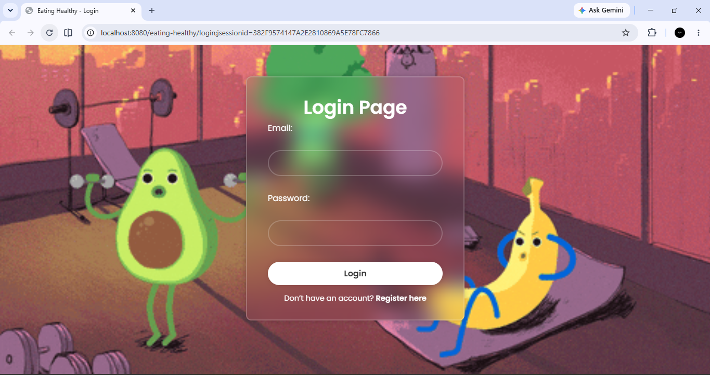
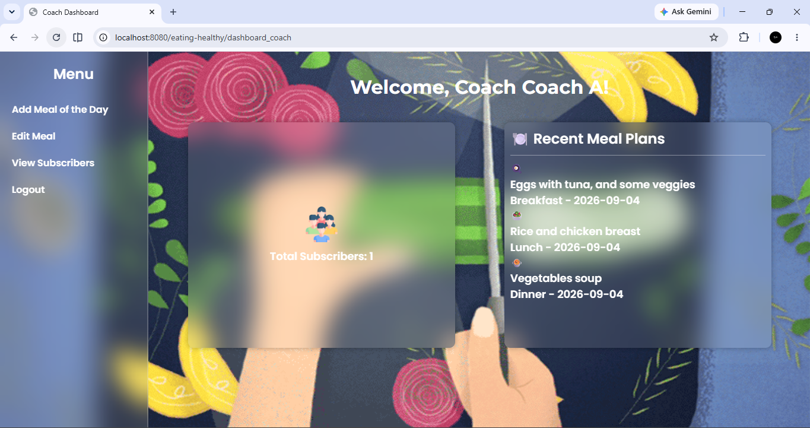
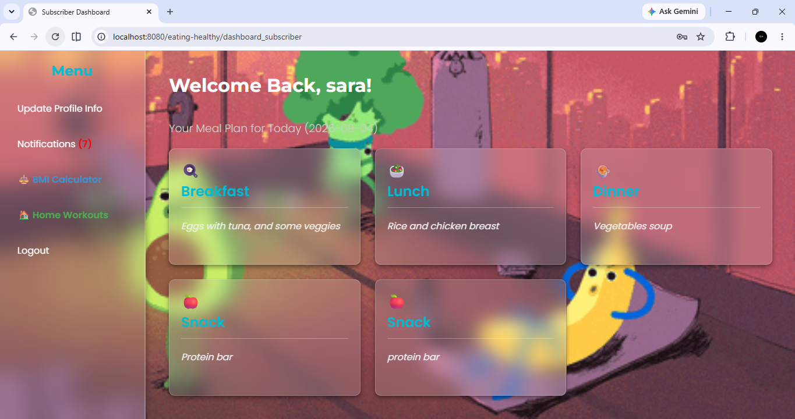
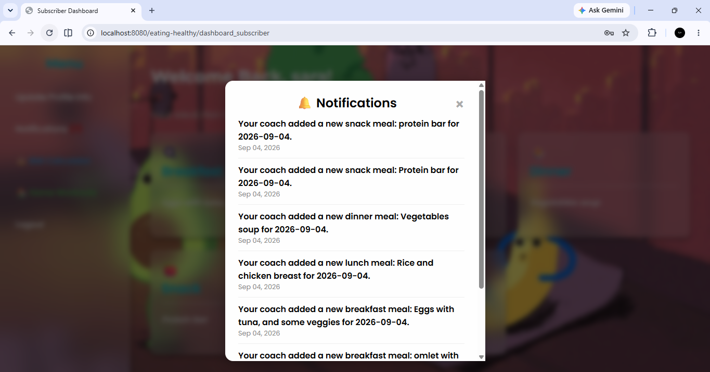
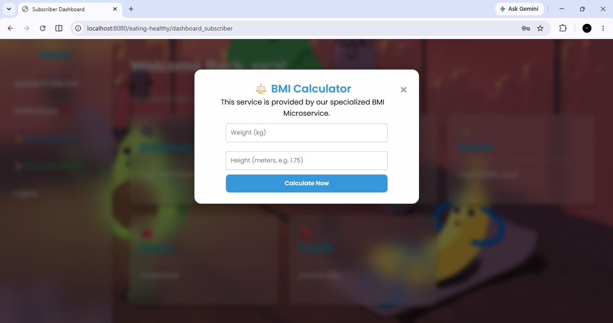
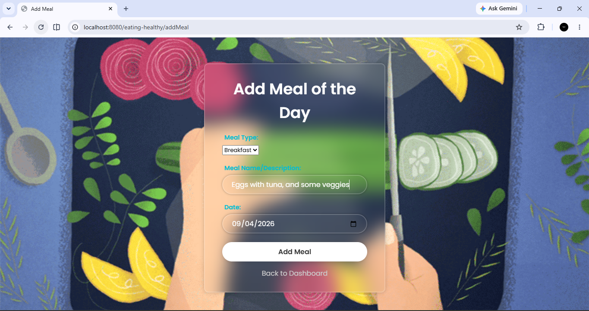
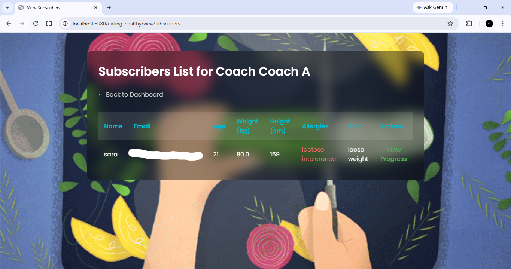
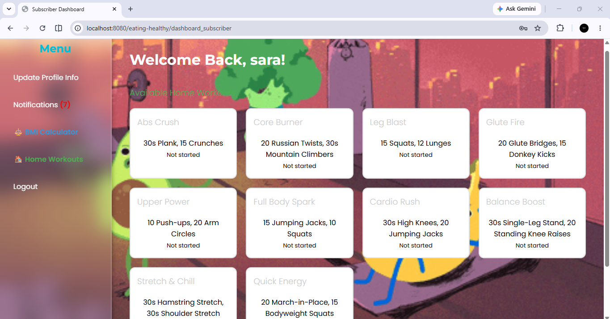
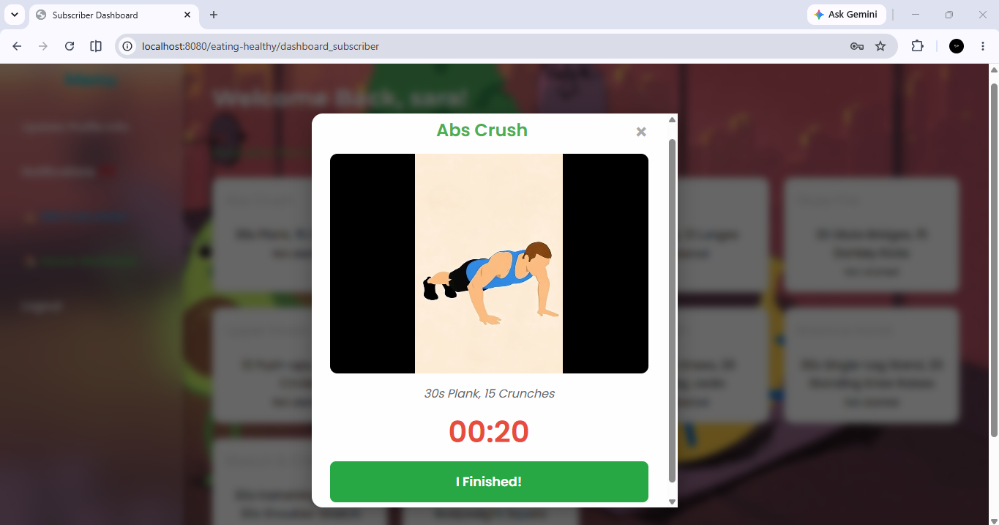

🥗 Eating Healthy Platform

A web-based fitness and nutrition management platform that connects coaches with their subscribers.

The platform allows coaches to manage meal plans and subscribers to track their nutrition, workouts, and BMI through an integrated multi-service architecture.

✨ Features

   👨‍🏫 Coach
- Register and log in
- Manage meal plans
- Add and edit meals
- View subscribers

   👤 Subscriber
- Register and log in
- View assigned meals
- View workout exercises and videos
- Calculate BMI
- Receive notifications when new meals are added
- Update personal profile

🏗️ Architecture

The project is composed of three main applications:

                    Eating Healthy Platform
                            │
              ┌─────────────┴─────────────┐
              │                           │
       Java EE Web App              REST Services
              │                     ┌─────┴─────┐
              │                     │           │
        SQL Server DB          Workout API   BMI API
              │                  :8081        :8083
              │                     │
              └─────────────┬───────┘
                            │
                      External Services
                            │
                         Mailjet

🛠️ Technologies

## Main Web Application
. Java EE
. Servlets
. JSP
. JDBC
. HTML / CSS / JavaScript
. SQL Server
. Apache Tomcat
. Maven
. REST APIs
. Java
. Spring Boot

## REST API
. JPA / Hibernate
. Maven

## External Services
. Mailjet API

📁 Project Structure
eating-healthy-platform/
│
├── eating-healthy/
│   └── Main Java EE web application
│
├── workout-api/
│   └── Spring Boot REST API
│
└── BMI/
    └── Spring Boot REST API
    
🔌 Services 

| Service        | Port | Purpose                          |
| -------------- | ---: | -------------------------------- |
| Eating Healthy | 8080 | Main web application             |
| Workout API    | 8081 | Provides workout data and videos |
| BMI API        | 8083 | Calculates BMI                   |

🗄️ Database

The platform uses Microsoft SQL Server.

The main application and Workout API use the same database.

Database credentials are stored using environment variables and are not included in the repository.

📧 Notifications

The platform integrates with the Mailjet API to send email notifications to subscribers when their coach adds a new meal.

🎯 Project Goal

The goal of the platform is to provide coaches with a simple way to manage nutrition and fitness content while giving subscribers a centralized dashboard to follow their plans.

👩‍💻 Author

Sara Zaanine

Master 2 — Computer Systems and Networks
University of Blida 1 — Saad Dahleb
2026
## 📸 Screenshots

### 01. Login Page

### 02. Coach Dashboard

### 03. Subscriber Dashboard

### 04. Notifications

### 05. BMI Calculator

### 06. Add Meal Form

### 07. View Subscribers

### 08. Workout API

### 09. Workout API

